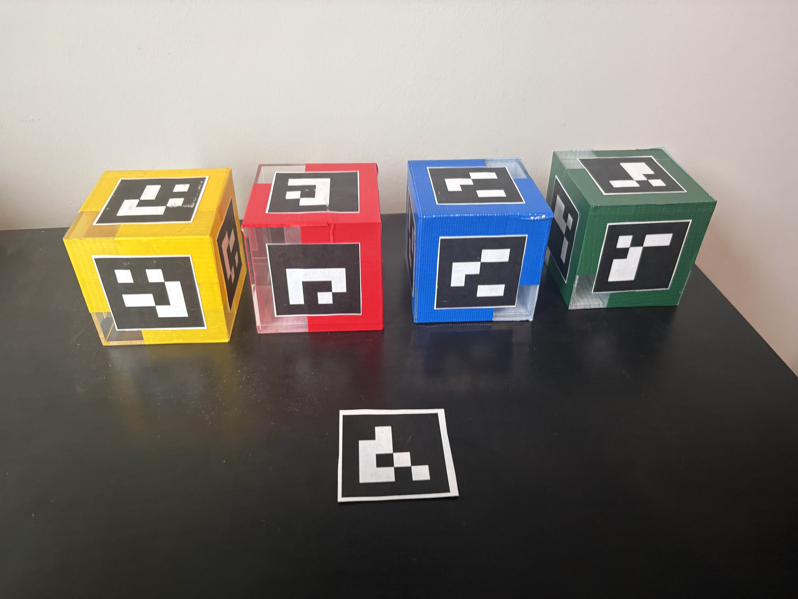

# Quest 3 Handtracker

Unity project for Meta Quest 3 mixed reality hand-tracking research using the Passthrough Camera API, ArUco-based table and cube tracking, and on-device recording of hand and task state.

This research was conducted using a Meta Quest 3. It has not been validated on other hardware, including the Meta Quest 3S.

This repository is the VR capture half of the workflow. The playback / simulator half lives in the companion repository:

- [GRPDC-CoppeliaSim](https://github.com/Evan-H-Rosenthal/GRPDC-CoppeliaSim)

## What This Project Does

The application runs on-device on a Quest headset and:

- Reads the headset passthrough RGB camera feed.
- Detects ArUco markers through an Android OpenCV bridge.
- Tracks a table origin marker and multiple marked cubes in world space.
- Guides a participant through three manipulation tasks.
- Records right-hand motion plus task-relevant scene state to disk for later replay and analysis.

The included build scene is:

- `Assets/Scenes/SampleScene.unity`

## Research Workflow At A Glance

1. Open the Unity project and let packages import.
2. Build and deploy the app to a Meta Quest 3.
3. Configure the headset so the app can use passthrough camera access.
4. Run the on-headset demo and complete the tasks.
5. Pull the generated recording files from the headset.
6. Use the exported recordings with the companion playback / simulation repository.

## Requirements

### Hardware

- Meta Quest 3
- USB cable for deployment and file transfer
- A table setup with ArUco markers and the instrumented cubes used by the experiment

### Software

- Unity Hub
- Unity Editor `6000.2.13f1`
- Android Build Support for that Unity version
- Android SDK, NDK, and OpenJDK installed through Unity Hub
- Meta Quest Developer Hub (recommended) or ADB for deployment / file access

### Unity Packages Used By The Project

The project depends on the packages already pinned in `Packages/manifest.json`, including:

- Meta XR Core SDK `85.0.0`
- Meta XR Interaction SDK `85.0.0`
- Meta XR MR Utility Kit `85.0.0`
- Meta XR Simulator `81.0.0`
- OpenXR `1.16.0`
- XR Management `4.5.3`
- Universal Render Pipeline `17.2.0`
- Input System `1.14.2`

## Install And Open The Project

1. Clone this repository.
2. Open Unity Hub.
3. Add the cloned folder as an existing project.
4. Open it with Unity `6000.2.13f1`.
5. Wait for Unity to restore packages and finish the first import.

Recommended Unity modules for this editor version:

- Android Build Support
- OpenJDK
- Android SDK & NDK Tools

## Headset Setup

Before attempting to run the project on hardware:

1. Put the Quest headset in Developer Mode.
2. Connect the headset to the development machine by USB.
3. Accept the USB debugging prompt inside the headset.
4. When you later want to copy recordings off the device, also accept the file access prompt after plugging it in.

## Materials Setup

### Materials Needed

- 3" x 3" x 3" acrylic cubes: [Amazon link](https://a.co/d/03P1hvuM)
- Colored duct tape: [Amazon link](https://a.co/d/07CVMWeI)
- 50 mm x 50 mm ArUco markers generated with `ArucoGenerator.ipynb` in this repository

Reference setup image:

### Marker Generation

Use `ArucoGenerator.ipynb` to generate and print:

- at least 1 copy of marker `#0`
- 6 copies each of markers `#1`, `#2`, `#3`, and `#4`

### Cube And Table Assembly

1. Wrap each acrylic cube in one of four unique colors: red, yellow, green, and blue.
2. Cut out the printed ArUco markers and keep the bezel around each marker as uniform as possible.
3. Attach one marker to each face of a cube using double-sided tape.
4. Use one marker ID per cube:
   red cube = all six faces use marker `#1`
   green cube = all six faces use marker `#2`
   blue cube = all six faces use marker `#3`
   yellow cube = all six faces use marker `#4`
5. Align the markers consistently on every cube face.
6. Make sure the top and bottom markers both face toward the same common side of the cube.
7. Affix one marker `#0` to the center of the work surface.

The tracking code expects the work surface origin marker to be marker `#0`, and the cube tracker IDs are intended to map to the four colored cubes above.

## Passthrough Camera API Configuration

This project uses the headset permission:

- `horizonos.permission.HEADSET_CAMERA`

The Unity project already includes that permission in `Assets/Plugins/Android/AndroidManifest.xml`, and the app requests it at runtime.

For the Passthrough Camera API to work in practice, future researchers should verify all of the following:

1. Use a supported headset. This project was developed and tested on Meta Quest 3.
2. Use a recent enough Horizon OS. Meta's current Unity Passthrough Camera API docs list `Horizon OS v74 or later` as a prerequisite.
3. Make sure passthrough is enabled on the headset, because Meta lists passthrough as a prerequisite for camera API access.
4. Launch the app on-device and approve the camera permission prompt when asked.
5. If camera access was denied previously, re-enable it in the headset's app permissions before testing again.

Important limitation from Meta's docs:

- Passthrough Camera API is not supported over Quest Link. Test this project as a native build running directly on the headset, not through Link play mode.

Meta references used for this section:

- [Passthrough Camera API Overview](https://developers.meta.com/horizon/documentation/unity/unity-pca-overview/)
- [Getting Started with Passthrough Camera API in Unity](https://developers.meta.com/horizon/documentation/unity/unity-pca-documentation/)

## Project Configuration Already In This Repo

Notable Android / XR settings already present in the project:

- Unity version: `6000.2.13f1`
- Scene in build: `Assets/Scenes/SampleScene.unity`
- Product name: `Quest 3 Handtracker`
- Application ID: `com.EvanRosenthal.CapstoneHandTracker`
- Scripting backend: `IL2CPP`
- Target architecture: `ARM64`
- Minimum Android SDK in project settings: `32`
- Manifest camera permission: `horizonos.permission.HEADSET_CAMERA`
- Manifest hand tracking permission: `com.oculus.permission.HAND_TRACKING`

If you regenerate the Android manifest through Meta tooling after upgrading Unity or packages, re-check that `horizonos.permission.HEADSET_CAMERA` is still present. Meta's current Unity camera API documentation explicitly calls this out for Unity 6-era projects.

## Build And Run On Device

### From Unity

1. Open the project.
2. Open `File > Build Settings`.
3. Switch platform to `Android` if needed.
4. Confirm `Assets/Scenes/SampleScene.unity` is enabled in the build.
5. Plug in the Quest headset and confirm it is visible to Unity / ADB.
6. Use `Build And Run` to install directly to the device.

### Existing APK In This Workspace

There is already an APK artifact in the project root:

- `Quest3HandTracker.apk`

That may be useful for quick redeployment, but future researchers should prefer rebuilding from source whenever they change scripts, packages, or project settings.

## Running The Experiment

When the app launches, the participant is guided through a short instruction flow and then through three tasks:

1. A 3-block stack task
2. A placement task
3. A 2-stacks-of-2 task

By default, recordings automatically start at task start and stop when a task completes. There is also a poke-driven recording toggle in the scene for manual control.

Operational notes that matter for data quality:

- The instructions explicitly ask the participant to use the right hand only.
- The recorder is attached to the right-hand hierarchy, so the recorded kinematic data is for the right hand.
- Tracking quality improves if the participant moves deliberately and avoids covering the cube markers more than necessary.
- If the virtual objects start behaving erratically, move closer to the table and slow down the motion.

## Recording Output Location

By default, recordings are written to:

- `Documents/HandRecordings/` on the headset's shared storage when available

If shared Documents storage is unavailable, the code falls back to:

- the app-specific external files Documents directory, typically
  `Android/data/com.EvanRosenthal.CapstoneHandTracker/files/Documents/HandRecordings/`, then
- `Application.persistentDataPath`

### How To Access The Files

1. Plug the headset into the computer with USB.
2. Put the headset on and allow file access if prompted.
3. Browse the headset storage from Windows Explorer, Meta Quest Developer Hub, or ADB.
4. Copy files out of `Documents/HandRecordings/`.

If the shared Documents folder is not populated, check the app-specific storage path under `Android/data/com.EvanRosenthal.CapstoneHandTracker/files/Documents/HandRecordings/` instead.

## Recording Format

Recordings are saved as timestamped files named like:

- `hand_recording_YYYYMMDD_HHMMSS.json`

Despite the `.json` extension, the file is best thought of as newline-delimited JSON:

- line 1 is a metadata object
- each following line is a per-frame record

Current schema details from the code:

- `recordType: "metadata"` header line
- `schemaVersion: 3`
- `recordType: "frame"` for every sampled frame

## What Data Is Collected

The recorder stores a mixture of hand state, table state, and cube state.

### Metadata Line

The first line stores run-level metadata including:

- whether recording stabilization was enabled
- whether wrist transforms were recorded
- whether fingertip positions were recorded
- whether joint rotations were recorded
- parent-child joint distances in meters
- wrist-to-finger-base offsets in meters

### Per-Frame Data

Each frame can include:

- elapsed time from recording start
- frame index
- whether joint rotations were enabled for that recording
- hand root pose in local space
- hand root pose in world space
- live table origin pose in world space, if tracked
- frozen recording-start table origin pose in world space, if enabled
- hand root pose relative to the table origin
- fingertip positions relative to the wrist:
  `thumb`, `index`, `middle`, `ring`, `little`
- tracked cube flags such as `cube1Tracked`
- cube poses relative to the table origin such as `cube1Table`
- optional local joint rotations for the selected finger joints

### Important Recording Options

The default recorder settings in `XRHandJointVisualizer` are:

- `recordWristTransforms = true`
- `recordFingerTipPositions = true`
- `recordJointRotations = false`
- `freezeTableOriginOnRecordingStart = true`
- `requireTrackedTableToStartRecording = false`

That means the default data emphasizes wrist + fingertip kinematics and table-relative cube state, while keeping per-joint rotation recording off unless a researcher explicitly enables it.

## Parameters You Can Tune

Most experiment behavior is controlled from Unity inspector fields on the scene objects rather than from config files. The most important tunables are summarized below.

### Camera / Marker Tracking (`CameraFeedViewer`)

Performance-focused knobs:

- `processingDownscale`: default camera processing downscale while tracking is healthy
- `lostMarkerProcessingDownscale`: fallback downscale used while recovering tracking
- `processEveryNthFrame`: skip processing to reduce load
- `maxTrackingUpdatesPerSecond`: hard cap on tracking work rate
- `enableMarkerTrackingPipeline`: turns the marker pipeline on or off

Table / marker tracking quality knobs:

- `markerSizeMeters`: physical ArUco marker size used for pose estimation
- `tableCenterMarkerId`: marker ID treated as the table origin
- `tablePoseSmoothing`
- `tableMaxPositionJumpMeters`
- `tableMaxRotationJumpDegrees`
- `tableOutlierFramesBeforeSnap`

Visualization knobs:

- `overlayMode`: `WireframePlane`, `SolidPlane`, or `AxesGizmo`
- `lineWidth`
- `solidPlaneOpacity`
- `gizmoScale`
- `drawDebugOverlay`
- `drawWorldMarkers`
- `updateCameraFeedTexture`
- `flipDisplayHorizontally`
- `flipDisplayVertically`
- `showStackHud`
- `showFpsCounter`
- `showPlacementTarget`

### Cube Tracking (`ArucoCubeTracker`)

Identity / geometry:

- `cubeMarkerId`
- `cubeLabel`
- `cubeSizeMeters`

Pose stability / responsiveness:

- `poseSmoothing`
- `useAdaptivePoseSmoothing`
- `stationaryPoseSmoothing`
- `movingPoseSmoothing`
- `adaptivePositionRangeMeters`
- `adaptiveRotationRangeDegrees`
- `singleMarkerResponsivenessMultiplier`
- `maxPositionJumpMeters`
- `maxRotationJumpDegrees`
- `outlierFramesBeforeSnap`

Single-marker ambiguity handling:

- `requireConfirmationForSingleMarkerFaceSwitch`
- `singleMarkerFaceSwitchConfirmationFrames`
- `requireConfirmationForSingleMarkerLargeRotation`
- `singleMarkerMaxTrustedRotationDeltaDegrees`
- `singleMarkerLargeRotationConfirmationFrames`

Hand-gated updates:

- `onlyUpdateWhenHandNear`
- `handNearDistanceMeters`
- `handFarDistanceMeters`

Visualization:

- `createRuntimeVisual`
- `cubeMaterial`
- `cubeColor`
- `wireframeLineWidthMeters`
- `hideOccludedWireframeEdges`
- `wireframeOccluderInsetMeters`
- `showLabel`

### Recording / Hand Stabilization (`XRHandJointVisualizer`)

Output control:

- `recordingDirectoryOverride`
- `recordWristTransforms`
- `recordFingerTipPositions`
- `recordJointRotations`

Recording interaction:

- `useControllerButtonToggle`
- `usePinchToggle`
- `recordingToggleZone`
- `useHeadRelativeToggleZone`
- `recordingToggleZoneRadius`
- `recordingToggleCooldownSeconds`

Stabilization and occlusion filtering:

- `stabilizeRecordedHandData`
- `rootPositionSmoothing`
- `rootRotationSmoothing`
- `jointRotationSmoothing`
- `occlusionSpikeAngleDegrees`
- `occlusionAngularVelocityThreshold`
- `occlusionHoldSeconds`
- `occlusionBlendMultiplier`

Table-origin behavior:

- `freezeTableOriginOnRecordingStart`
- `requireTrackedTableToStartRecording`

## Research Notes And Caveats

- This project is intended for on-device testing. Do not rely on Quest Link for camera API validation.
- The passthrough camera permission may be present in the manifest but still requires runtime approval by the user.
- Marker size and cube size must match the real physical setup. If they do not, world scale and table-relative recordings will be wrong.
- The recorder assumes the experimental table origin can be derived from the configured `tableCenterMarkerId`.
- The project uses an Android OpenCV bridge under `Assets/Plugins/Android/src/com/GeorgiaTech/aruco/` plus the native library `Assets/Plugins/Android/libs/arm64-v8a/libopencv_java4.so`. If either side is removed or version-mismatched, tracking will fail.
- The current instruction flow is tailored to a specific human-subject demo. If you are running a different study, update the UI text and task logic so the recordings match your protocol.
- The saved file extension is `.json`, but downstream tooling should parse it as JSON Lines / NDJSON rather than as one large JSON array.

## Repository Layout

- `Assets/Scenes/SampleScene.unity`: main experimental scene
- `Assets/CameraFeedViewer.cs`: passthrough acquisition, marker detection, table tracking, task logic
- `Assets/ArucoCubeTracker.cs`: cube pose resolution and visualization
- `Assets/XRHandJointVisualizer.cs`: hand recording and export
- `Assets/PokeRecordingToggle.cs`: poke-based manual recording toggle
- `Assets/InstructionFlowController.cs`: participant instruction flow
- `Assets/Plugins/Android/`: Android manifest, OpenCV bridge sources, native OpenCV library

## Companion Repository

To replay or simulate the captured data, use:

- [GRPDC-CoppeliaSim](https://github.com/Evan-H-Rosenthal/GRPDC-CoppeliaSim)

This repository produces the recordings. The companion repository consumes them for playback / simulation, so both repos should be versioned and documented together during future research handoffs.
